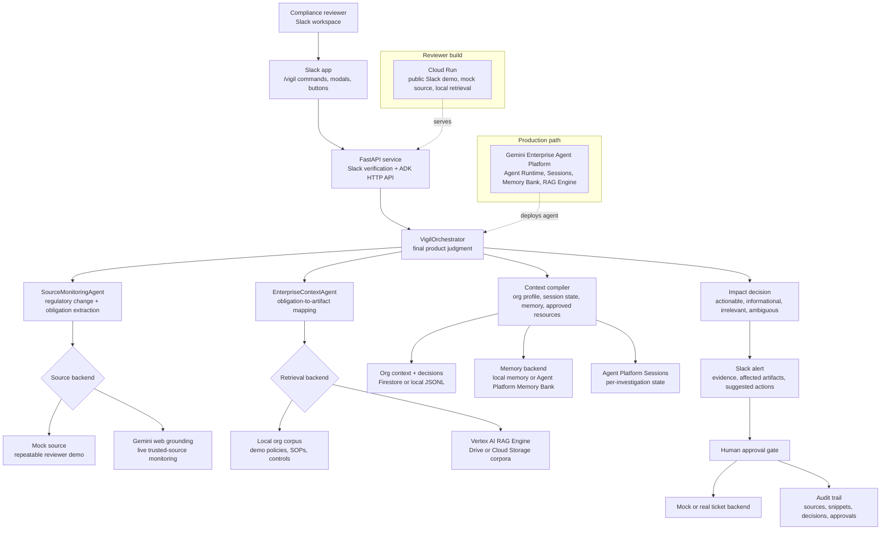

# Vigil Architecture Diagram

Vigil keeps the orchestrator responsible for the final impact judgment. The subagents are deliberately bounded: they gather cited regulatory evidence and cited enterprise context, then return structured findings to the orchestrator for classification, Slack presentation, approval gating, ticket creation, memory updates, and audit logging.
